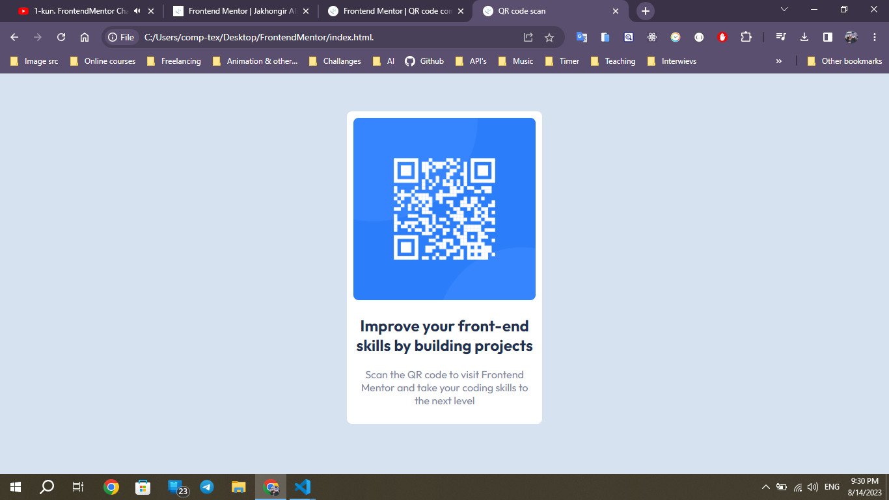
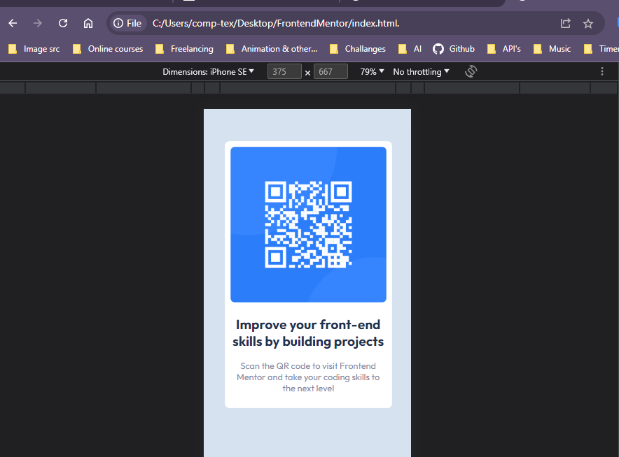

# Frontend Mentor - QR code component solution

This is a solution to the [QR code component challenge on Frontend Mentor](https://www.frontendmentor.io/challenges/qr-code-component-iux_sIO_H). Frontend Mentor challenges help you improve your coding skills by building realistic projects. 

## Table of contents

- [Overview](#overview)
  - [Screenshot](#screenshot)
  - [Links](#links)
- [My process](#my-process)
  - [Built with](#built-with)
  - [What I learned](#what-i-learned)
  - [Continued development](#continued-development)

- [Author](#author)

## Overview

This project created for FrontendMentor challange 1
You can see running project and code here !

### Screenshot

### Links

- Solution URL: [Github code](https://github.com/JakhongirAlijonov/FrontendMentor-challange1)
- Live Site URL: [Netlify host](https://qrcode-frontendmentor-ja.netlify.app/)

### Built with

- Semantic HTML5 markup
- CSS custom properties
- Flexbox
- Mobile-first workflow

### Continued development

Use this section to outline areas that you want to continue focusing on in future projects. These could be concepts you're still not completely comfortable with or techniques you found useful that you want to refine and perfect.

## Author

- Website - [Jakhongir Alijonov](https://github.com/jakhongiralijonov)
- Frontend Mentor - [FrontendMentor ](https://www.frontendmentor.io/profile/JakhongirAlijonov)

